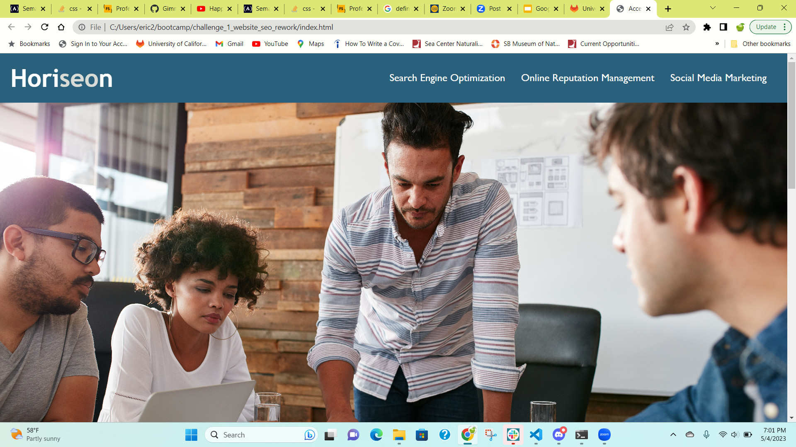
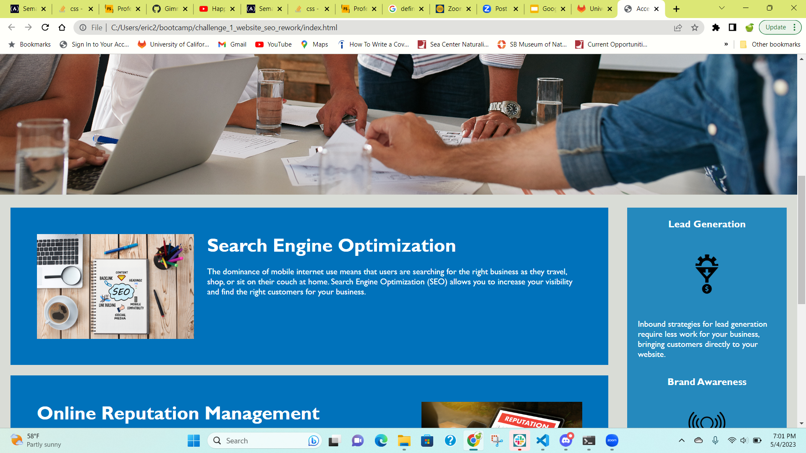
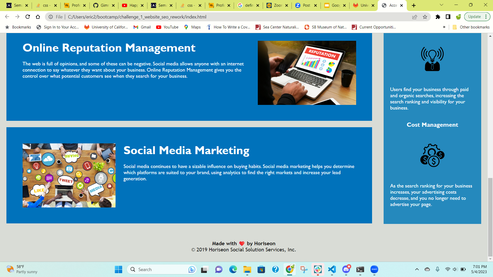

# <Website SEO Rework>

## Description

The purpose of this project was to make a search engine optimization (SEO) company's website more accessible to people with disabilities. The initial version of the website did not use semantic HTML tags, had a vague title, and used images with no alt attributes. This project solved these issues and made the website functional for vision-impaired users and those who use screen readers. I learned what it means for a website to be accessible and what makes HTML elements semantic.

## Installation

No installation is required for this project.

## Usage

The following screenshots show the website's appearance:

The deployed website can be [found here](https://gimmekitties711.github.io/challenge_1_website_seo_rework/).

## Credits

Collaborated with Jarely Garfias, Kyndal Bowers, and Melissa Kalish to discuss the project through Zoom on 05_03_2023.

Changed the HTML tags to semantic tags using [this guide](https://www.freecodecamp.org/news/semantic-html5-elements/).

Use of the strong tag in the header was inspired by the comment from Paul Millar in [this Stack Overflow page](https://stackoverflow.com/questions/5137465/what-are-alternatives-to-the-span-element).

This README was adapted from [this template](https://coding-boot-camp.github.io/full-stack/github/professional-readme-guide).

## License

No license is attached to this repository.

---
